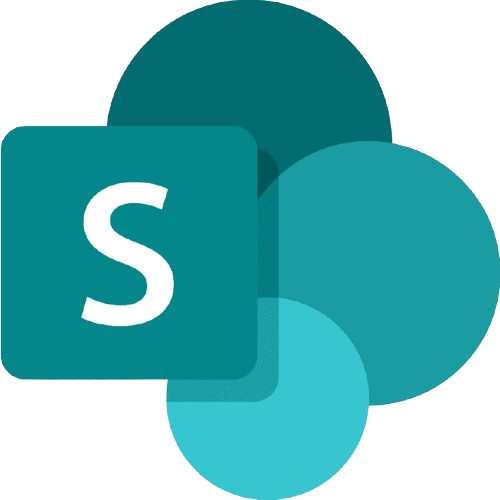

🇺🇸 English · [🇧🇷 Português](./README-br.md)

 

 

  

## <samp>&gt; about me</samp>

 

**Software Engineering** student focused on **web development**. Currently deepening my knowledge of **HTML, CSS and JavaScript**, with a foundation in **Python** and hands-on experience building apps and automations with the **Power Platform** (Power Apps, Power Automate and SharePoint). Creator of **[ConectaServ](https://www.conectaserv.site/)**, a platform that connects service providers to clients — my first published project.

 

## <samp>&gt; tech stack</samp>

 

 

## <samp>&gt; github stats</samp>

 

  

 

